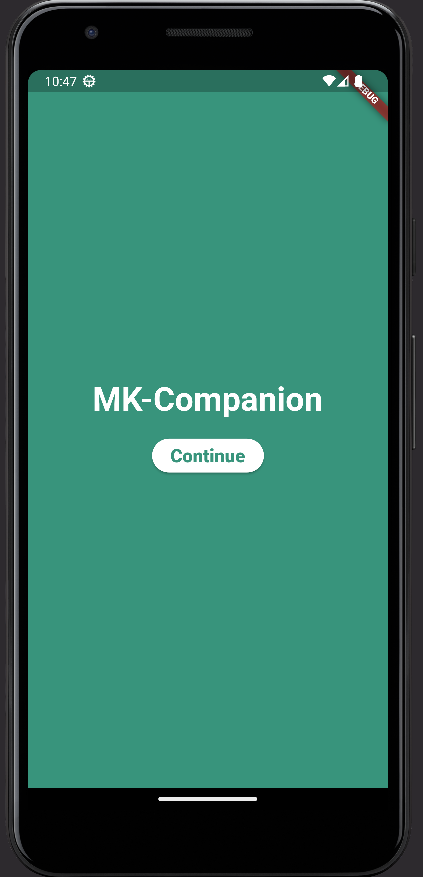
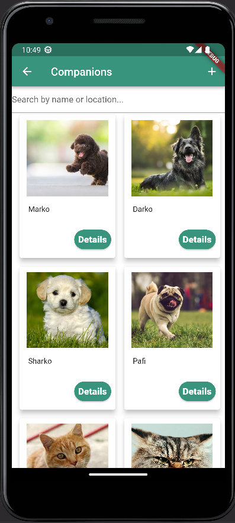
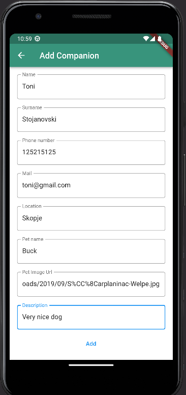
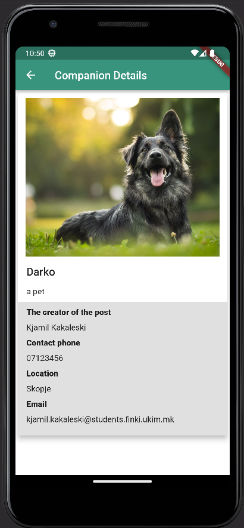
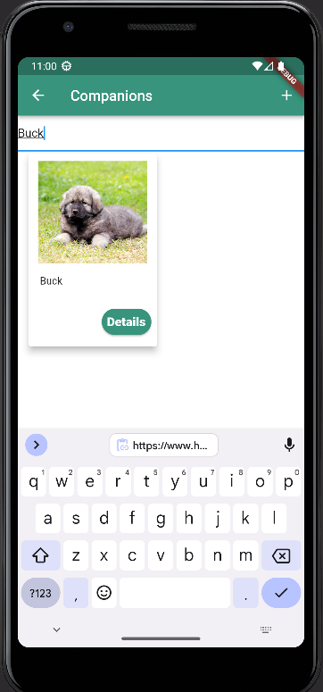

# MK – Companion | МК – Миленик

## Вовед

**MK – Companion** е мобилна апликација која ќе му служи на корисникот да
може да поставува и да разгледува огласи за миленици кои немаат дом.
Огласот има визуелен приказ на податоците: слика од миленичето, краток
опис и други потребни податоци за контакт.

Главните цели кои апликацијата пробува да ги долови е потребата на
корисникот да си го зголеми својот дом со нов член на семејството или ако
тој не е во можност да се грижи за своето милениче, може на истото да му
најде нов соодветен дом преку поставување на оглас.

## Карактеристики и Flow

1. **Преглед на огласи** – Кои биле внесени од страна на останати корисници

2. **Поставување оглас** – Преку копчето „+“ во горниот десен агол
 корисникот може да додаде нов оглас за миленик каде што ќе ги
 внесе потребните податоци.

3. **Приказ на детали на оглас** – При клик на копчето „Details“ на
 специфичен оглас се прикажуваат информациите за него. Тука
 произлегува и можност за контакт со лицето кое го поставил огласот
 преку сервисите за мејл или повик.

4. **Филтрирање на огласи** – При внес на текст во search bar-от,
 корисникот има можност да ги пребарува огласите по име на
 миленик или по локација (град).

## Користена технологија

MK – Companion е изработена во **Flutter(Dart програмски јазик)** и
претставува cross-platform апликација, сепак, нејзината главна намена ќе
биде кај паметните телефони, односно Android и IOS.

## Код и зависности

Структурата на проектот е прикажана на следната слика:

Проектот е поделен на неколку целини и тоа:

• **model** – Тука се сместени основните класи за моделите кои што се
 користат, а тоа се моделот за еден корисник (се за него) и модел за
 оглас на миленикот

• **provider** – овде се наоѓа сервисот кој во него содржи методи за

додавање на огласи

• **screen** – екраните за приказ на сите три основни карактеристики на
 апликацијата се напишани овде: Екран за додавање на оглас, екран за
 приказ на сите огласи и екранот за детали.

• **widget** – тука се наоѓаат компонентите кои ги реискористуваме во
 целокупното flow. Тоа се картичката на миленикот(companion\_tile
 widget) и widget-от за контакт кој се користи во екранот за детали. Тој
 ги користи сервисите за локација(при клик на локацијата во екранот за
 детали), сервисот за mail кој не пренасочува кон mail апликација и
 сервисот за повик, кој се активира при клик на телефонскиот број во
 детали.

**Зависностите** кои беа користени во овој проект се:

cupertino\_icons: ^1.0.2
url\_launcher: ^6.0.3
provider: ^6.0.5
